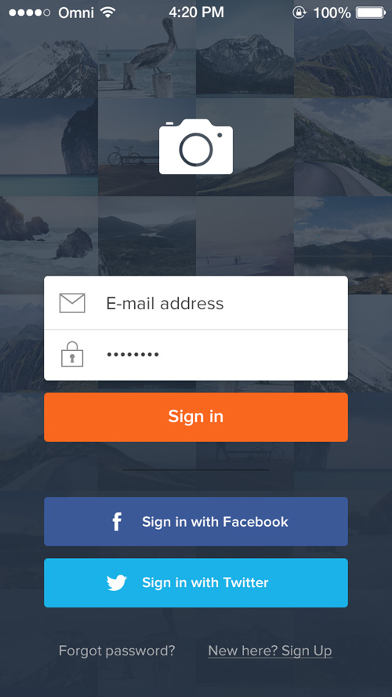
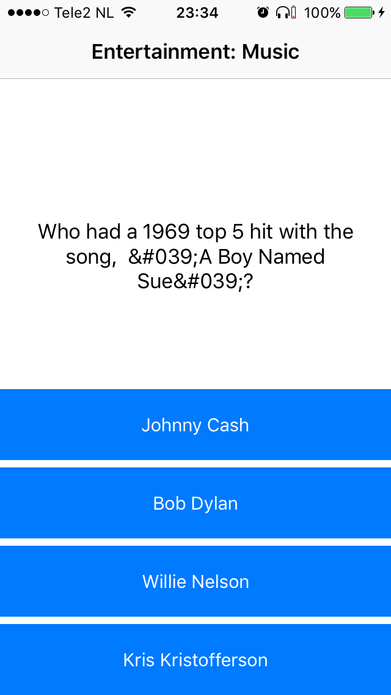
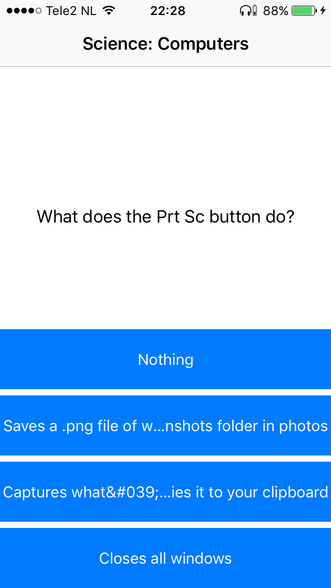

# Day 1 (monday 15-01)
* Created a login screen and fixed email/password authentication. 
* Provided proper error alerts at login screen.
* Sign up function is also active. Signing up a new account will send user data to the database, all attributes of a profile are set now.
* Started working on Facebook Login authentication.
* The design of the login screen is inspirated by the login screen below (found on Google Images)

# Day 2 (tuesday 16-01)
* Set up the tab bar controller with the different views; home, leaderboard and profile.
* Created a ProfileViewController for the current user to check his/her personal info. This info is retrieved from the realtime database of Firebase.
* Facebook Login authentication successfully implemented. Managed to retrieve Facebook profile picture. Still need to fix saving user data at the Firebase database when facebook account is created.
* Failed to load the top 10 users (both daily & weekly) with scores from the user database.
* Failed to push all changes to github, tried for a couple of hours to fix it.

# Day 3 (wednesday 17-01)
* Finally managed to push all files to github, but still some kind of bug (submodule).
* Updated my process book on github.
* Made a style guide and pushed it to my github repository.
* Pushed all changes to github, still some little bug that needs to be fixed.
* Managed to load the daily AND weekly top 10 users(!) with their scores (descending) from the user database.
* Started to work on saving user data when new account is created with Facebook login.

# Day 4 (thursday 18-01)
* Created all views from the wireflow. 
* The user gets presented questions and corresponding answers (these are hard coded) and the score gets presented afterwards.
* Created a PlayerDetailViewController so that users can check the profiles of the players in leaderboards.
* Clicking on users in the leaderboard and go to user’s profile is possible.
* Started working on API calls.

# Day 5 (Friday 19-01)
* Presentation of alpha version.
* Tried to fix sign in/sign out bug.

# Weekend 20-01/21-01
* Made a custom table view cell to properly present the different labels in a table cell.
* Successfully implemented API calls to fetch and show questions and their corresponding answers.
* Implemented an unwind segue, so Sign out bug was fixed.
* Created an UIView that gives an indication about the time that is left to answer the question.
* Score gets updated in Firebase when user fills in a questions.

# Monday 22-01
* Timeline to represent available time to answer question (+ bug fix first question)
* (Bug fix) answer button labels longer than button width: auto resize button label, see right image below
* Decode questions and answers which contain html/xml entities, see problem at left image below
* Facebook user sign out bug fix
* Bug fixed: the app tried to load data from Firebase that was already deleted.

## Things I still have to implement in my app:
* UIImagePicker to change profile picture
* Save profile picture in Firebase Storage
* Bug fix: ScoreView to HomeView unwind segue
* Actually do something when timer ends
* Provide feedback when question is answered (or not answered)
* Save fetched questions in database, so that every user gets the same questions
* Get local time to reset daily points every day
* Complete list of decode entities

