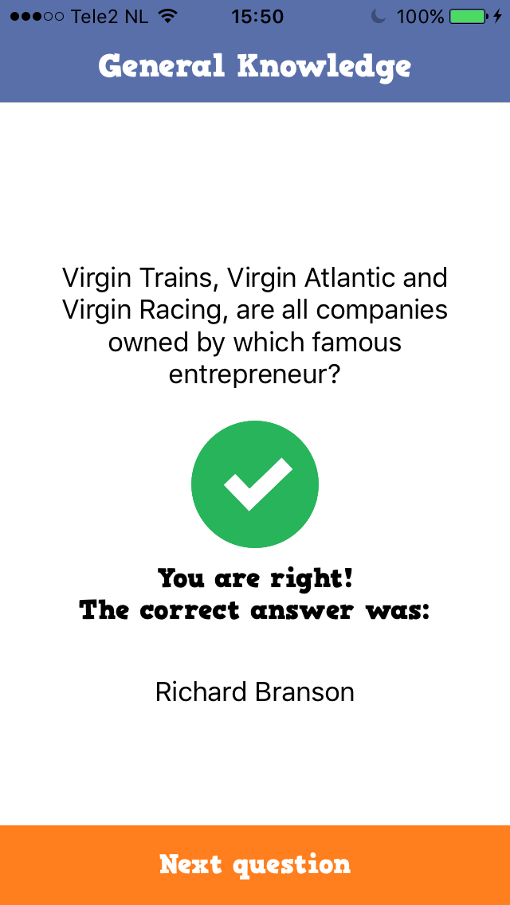

# REPORT

**Application name:** Triviapp  
**Student name:** Rob Dekker  
**Student ID:** 11020067  

## A short description of the application
Challenge your friends every single week of the year with this application! Triviapp is a game where players are able to compete with eachother by answering questions from the Open Trivia Database. In order to make this a fair "fight", all players will get the same questions per day.  

**Screenshot**  
       

## Technical design

### Overview
Opening the application for the first time will lead you (ofcourse) to the Login screen. New users will have to fill in  
a form in order to create a new account. It's also possible (and easier) to create a new account with Facebook login. When a user is logged in, the Home screen will be presented. Here is presented some information about the user itself and about eventually available questions to answer. From the Home screen, the user is able to navigate to the leaderboards and his/her profile with the Tab Bar. It's also possible to directly start the quiz with the daily questions fetched from the API. The user has to answer all questions in order to see their score. There are two different leaderboards, one for the daily top players and one for the weekly top players. From the leaderboards, it is possible to view information of other accounts by clicking on them (such as their current level).  

### Login screen
I've spend some time to create a goodlooking design for the login screen. When the user opens the application for the first time, it will be required to create a new account by either filling in a form or by logging in with Facebook. The former consists of three input textfields: one for username, one for email adress and one for password. There are implemented some restrictions here, such as the password needs at least six characters and the emailadress needs to be in the correct form. Whether you create an account via Facebook or via email/password, there will be send some "initial" values to the Firebase database. There will be created an entry with the user ID as key, and with the values username, level, dailyPoints, weeklyPoints, totalPoints, imageURL and lastTimeAnswered. DailyPoints and weeklyPoints are set to zero, level is set to 1, obviously, and the imageURL is set to "default_profile". This initial imageURL represents a default profile image. When a user logs in via Facebook, the imageURL will contain the url linked to the current user's Facebook profile picture. TotalPoints will be set to one hundred, this is needed because I've implemented a function that calculates the level based on the totalPoints, and it needs at least a value of a hundred in order to function correctly. LastTimeAnswered is set to an empty string, because this value will be updated later on. When the user has managed to create a new account, or logs in with an existing account, the user will be redirected to the Home screen due to the listener.

### Home screen
There is a lot going on at the Home screen, because it checks various variables in order to determine whether the user has some questions to play or not. First of all, it presents the user that is logged in, these values come from Firebase. Afterwards, a function is called which retrieves data about the questions that are in Firebase, or not. There is data about the date the questions were fetched, the current date and the current weekday (this is an integer). According to these values, a second function is called which determines what to do: 
* If there are questions in Firebase, check if the current day is monday so all daily and weekly points need a reset and new questions need to be fetched from the API and afterwards send to Firebase with the current date and weekday. 
* If the current day is not monday, it needs to check if the questions were fetched from the API today. If they were, get these from Firebase if the user have not answered them already, otherwise say "No questions available". If they were fetched another day, fetch new questions from the API, send them to Firebase afterwards with the current date and weekday, and reset the daily points of all players.
* If there are no questions stored in Firebase at all, new questions will be fetched. This will occur only the first time the app is in use.
Tapping on the "start quiz" button will immediately change the value of lastTimeAnswered to the current day, so cheating is not possible (like closing and reopening the app). The questions, wheter fetched from the API or from Firebase, will be presented in the Question screen due to the ```prepare(for segue:)```. Finally, I've implemented an animation to get the user's attention to the "start quiz" button if it is enabled.

### Question screen
For every question in the list of questions, all labels and buttons will be updated to satisfy with the corresponding category and answers. There are always four answers to each questions and of which there is always one correct answer. The correct answer will be randomly placed each question. I've implemented a timer, so when all labels are set, the countdown starts. Besides from that, I've created an animation that gives an indication about the time that is left for the user to answer the question. Whether the user taps the correct answer, the incorrect answer or no answer at all, the appropriate feedback will be shown. This feedback consists of an image, a label that says "wrong" or "false", and the correct answer. Also, the question stays visible to improve user experience. When the user taps the correct answer, the daily, weekly and total points will be immediately updated in Firebase. For every 100 totalPoints, the user's levels increments by one! The total points gathered with the daily quiz will then be presented in the Score screen.

### Score screen
Here, the user get's his/her feedback on the just finished daily quiz. A label, which covers the most of the screen, represents the amount of points gathered out of 10 (the total amount of points that can be collected). In addition, there are stars presented. The amount of colored stars is equal to the amount of points gathered. I've added a delay to this, so that it gets a fluent animation. The user then has to unwind to the Home screen.

### Leaderboard screen
All users are stored in Firebase with their current daily and weekly points. In the Leaderboard screen, a table view loads the current daily and weekly top 10 players, respectively based on their daily and weekly points. The database reference keeps synchronised so that the table view gets updated whenever a value has changed. I have also implemented a segmented control, so that it is easily to switch between the current daily top players and the current weekly top players. A seperate swift file named ```LeaderboardTableViewCell.swift``` stores a couple of labels and an image, in order to create a custom table view cell. Clicking on a table view cell will create a segue to the corresponding user's Profile screen.

### Profile screen
There are a couple of values that can be presented of a player, such as the username, level, current daily and weekly points, and the profile picture. The ```func updateUI()``` checks whether it is another player or the current user before setting the labels. There is added a background image behind the profile picture, that represents the profile picture but has been blurred to improve the design. Ofcourse, when another player than the current user is presented, the sign out button will be hidden, so uncertainties are avoided. The sign out button distinguishes a Facebook user from a "normal" user when signing out. Apart from this, I have implemented the Kingfisher module. The Kingfisher module features asynchronous image downloading and caching, and it is very easy to use.

### ItemController
This is where the questions are fetched from the API. It is a JSON dictionary from where the category, question, correct answer and incorrect answers are retrieved. These values are then translated to a Question object and appended to a list. Just before they are appended, the question and corresponding answers needed to be decoded. I have manually set up a dictionary with HTML/XML entities.

### User.swift
The User struct represents the user and has an initializer provided by Firebase. The user ID and email are used to create user authentication.

### Question.swift
The Question struct stores all possible attributes of a question that are fetched from the API.

### Player.swift
The Player struct stores all possible attributes of a user that is stored in Firebase.

### Info.plistset
In the folder *Resources* I have added a custom Font family named *HVD_Comic_Serif_Pro*. In order to be able to use this custom Font family, I had to add an entry in the Information Property List named *Fonts provided by application*. This Font helps to create a design that fits better when creating a game. I also had to add several entries to be able to use Facebook login. In the Info.plist, I have set the *App Transport Security Settings* as well.

## Challenges

### Wireflow
With regard to my design document, I haven't implemented the PlayerDetailViewController. During the process of creating the wireflow of my application, I found out that it was possible to link to the ProfileViewController and check whether it is the current user or another user. So both cases are possible to view on one ViewController.

### Building the app

## Decisions

### In an ideal world
In an ideal world, with much more time and especially much more MONEY, I would choose to buy a laptop that can handle Xcode without any problems. It took so incredibly long every time to build the application and the program (and my Mac) often froze.
